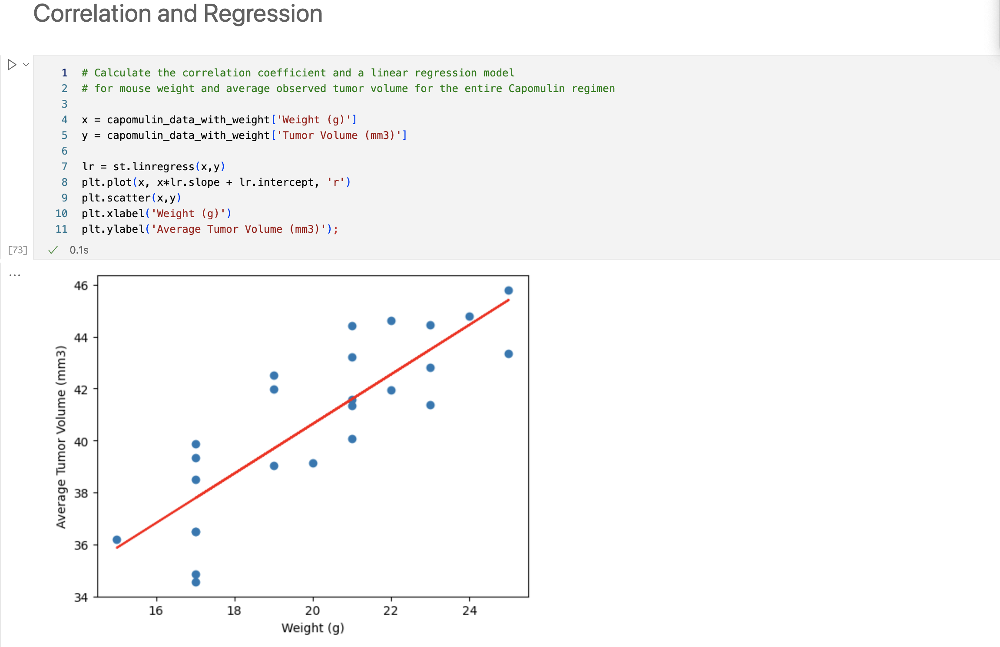

# matplotlib-analysis

## Website: 
[website](https://github.com/mrslinton/matplotlib-analysis)

## Description
Analysis of potential treatments for squamous cell carcinoma (SCC), a commonly occurring form of skin cancer

## Table of Contents
- [Installation](#installation)
- [Usage](#usage)
- [Credits](#credits)
- [License](#license)
- [Features](#features)

- [Contact](#contact)

## Installation
matplotlib, python, pandas, scipy.stats

## Usage
Run the ipynb file

## Credits
Jennifer Harris

## License
MIT

## Features
charts( bar, line, scatter, box plot, regression)

## Contact
If there are any questions of concerns, I can be reached at:
##### [github: mrslinton](https://github.com/mrslinton)
##### [email: jennifer.v.harris@outlook.com](mailto:jennifer.v.harris@outlook.com)
